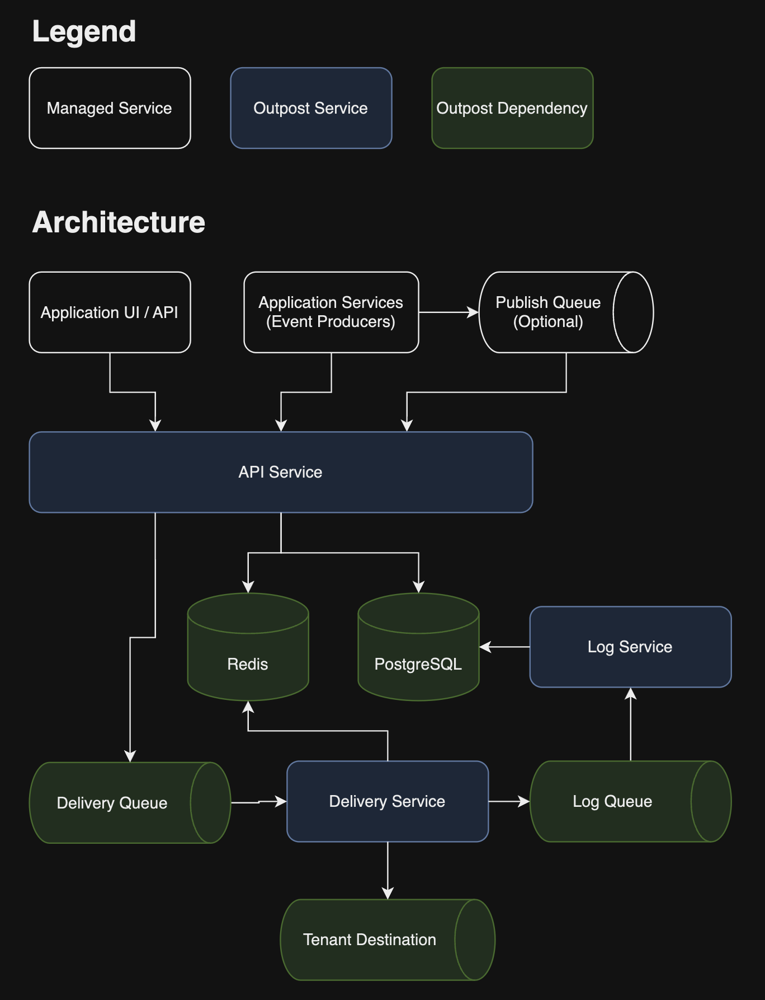

<br>

<div align="center">
  <picture>
    <source media="(prefers-color-scheme: dark)" srcset="images/outpost-logo-white.svg">
    
  </picture>
</div>

<br>

<div align="center">
  
[](#license)
[](https://goreportcard.com/report/github.com/hookdeck/outpost)
[](https://github.com/hookdeck/outpost/issues)
 [](https://hookdeck.com/outpost)
  
</div>

<div align="center">
SDKs:

[](sdks/outpost-go/README.md)
[](sdks/outpost-typescript/README.md)
[](sdks/outpost-python/README.md)

[Documentation](#documentation)
·
[Report a bug](issues/new?assignees=&labels=bug&projects=&template=bug_report.md&title=%F0%9F%90%9B+Bug+Report%3A+)
·
[Request a feature](issues/new?assignees=&labels=enhancement&projects=&template=feature_request.md&title=%F0%9F%9A%80+Feature%3A+)

</div>

<div align="center">
  <h1>Outbound Webhooks and Event Destinations Infrastructure</h1>
</div>

Production-ready infrastructure for sending webhooks and delivering events from your platform to your customers' systems. Self-host it anywhere, or use [Hookdeck Outpost](https://hookdeck.com/outpost) as a managed service.

Add outbound webhooks and [Event Destinations](https://eventdestinations.org) to your platform, with support for Webhooks, Hookdeck Event Gateway, Amazon EventBridge, AWS SQS, AWS S3, GCP Pub/Sub, RabbitMQ, and Kafka. Outpost handles retries, tenant isolation, observability, and provides a portal for your end users.

The runtime has minimal dependencies (Redis/Redis cluster, PostgreSQL, a supported message queue), is 100% backward compatible with your existing webhook implementation, and is optimized for high-throughput, low-cost operation.

Outpost is built and maintained by [Hookdeck](https://hookdeck.com). Written in Go. Distributed as a binary and Docker container. Licensed under Apache-2.0.



Read [Outpost Concepts](https://outpost.hookdeck.com/docs/concepts) to learn more about the Outpost architecture and design.

## Features

- **Multi-tenant support**: Create multiple tenants on a single Outpost deployment.
- **User portal**: Allow customers to view delivery metrics, manage destinations, debug delivery issues, and observe their event destinations.
- **Delivery failure alerts**: Get notified when destinations are failing so you can act before your customers notice.
- **Event topics and topic-based subscriptions**: Supports the common publish and subscription paradigm to ease adoption and integration into existing systems.
- **At least once delivery guarantee**: Messages are guaranteed to be delivered at least once and never lost.
- **Automatic and manual retries**: Configure retry strategies for event destinations and manually trigger event delivery retries via the API or user portal.
- **Event fanout**: A message sent to a topic is replicated and delivered to multiple endpoints for parallel processing and asynchronous event notifications.
- **Publish events via the API or a queue**: Publish events using the Outpost API or configure Outpost to read events from a publish queue.
- **OpenTelemetry**: OTel standardized traces, metrics, and logs.
- **Webhook best practices**: Opt-out webhook best practices, such as headers for idempotency, timestamp and signature, and signature rotation.
- **SDKs and MCP server**: Go, Python, and TypeScript SDKs are available. Outpost also ships with an MCP server.
- **Event destination types**: Out of the box support for Webhooks, Hookdeck Event Gateway, Amazon EventBridge, AWS SQS, AWS S3, GCP Pub/Sub, RabbitMQ, and Kafka.

See the [Outpost Features](https://outpost.hookdeck.com/docs/features) for more information.

## Why Outpost

Outpost is a good fit if:
- You're adding outbound webhooks to your platform for the first time
- You're replacing a homegrown webhook system that's become a maintenance burden
- You want to offer your customers more than just HTTP callbacks (queues, brokers, buses)
- You need multi-tenant isolation with a customer-facing portal out of the box
- You want full control over your infrastructure and data

Outpost is backward compatible with your existing payload format, HTTP headers, and signatures — you can drop it into what you already have.

## Documentation

- [Overview](https://outpost.hookdeck.com/docs/overview)
- [Concepts](https://outpost.hookdeck.com/docs/concepts)
- [Quickstarts](https://outpost.hookdeck.com/docs/quickstarts)
- [Features](https://outpost.hookdeck.com/docs/features)
- [Guides](https://outpost.hookdeck.com/docs/guides)
- [API Reference](https://outpost.hookdeck.com/docs/api)
- [Configuration Reference](https://outpost.hookdeck.com/docs/references/configuration)

## Quickstart

### Deploy to Railway

[](https://railway.com/deploy/outpost-starter?referralCode=NRulS_)

Once the deployment is complete, configure your `TOPICS` environment variable to the topics supported for destination subscriptions, publishing, and routing of events. For example, `TOPICS=user.created,user.updated,user.deleted`.

Once deployed, you'll need the public Railway URL of your Outpost instance (referred to as `$OUTPOST_URL` below) and the generated `API_KEY` environment variable value to authenticate requests.

### Deploy locally with Docker

Ensure you have [Docker](https://docs.docker.com/engine/install/) installed.

Clone the Outpost repo:

```sh
git clone https://github.com/hookdeck/outpost.git
```

Navigate to `outpost/examples/docker-compose/`:

```sh
cd outpost/examples/docker-compose/
```

Create a `.env` file from the example:

```sh
cp .env.example .env
```

Update the `$API_KEY` value within the new `.env` file.

#### Redis Configuration

Outpost supports both standard Redis and cluster Redis configurations:

**Standard Redis** (default, for local development and single-node Redis):
```env
REDIS_HOST="redis"
REDIS_PORT="6379" 
REDIS_TLS_ENABLED="false"
REDIS_CLUSTER_ENABLED="false"
```

**Redis Cluster** (for Redis Enterprise and managed Redis services):
```env
REDIS_HOST="your-redis-cluster.example.com"
REDIS_PORT="10000"
REDIS_TLS_ENABLED="true"
REDIS_CLUSTER_ENABLED="true"
```

For other cloud Redis services or self-hosted Redis clusters, set `REDIS_CLUSTER_ENABLED="true"` if using Redis clustering.

**Troubleshooting Redis connectivity**: Use the built-in diagnostic tool to test your Redis connection:
```sh
go run cmd/redis-debug/main.go your-redis-host 6379 password 0 [tls] [cluster]
```
See the [Redis Troubleshooting Guide](https://docs.outpost.hookdeck.com/references/troubleshooting-redis) for detailed guidance.

Start the Outpost dependencies and services:

```sh
docker-compose -f compose.yml -f compose-rabbitmq.yml -f compose-postgres.yml up
```

Outpost is running on `localhost:3333`. Use this value as your `$OUTPOST_URL`.

### Try out Outpost

> [!TIP]  
> You can use shell variables to store the tenant ID and API key for easier use in the following commands:
>
> ```sh
> OUTPOST_URL=http://localhost:3333
> TENANT_ID=your_org_name
> API_KEY=your_api_key
> URL=your_webhook_url
> ```


Check the services are running:

```sh
curl $OUTPOST_URL/api/v1/healthz
```

Wait until you get a 200 response.

Create a tenant with the following command, replacing `$TENANT_ID` with a unique identifier such as "your_org_name", and the `$API_KEY` with the value you set in your `.env`:


```sh
curl --location --request PUT "$OUTPOST_URL/api/v1/tenants/$TENANT_ID" \
--header "Authorization: Bearer $API_KEY"
```

Run a local server exposed via a localtunnel or use a hosted service such as the [Hookdeck Console](https://console.hookdeck.com?ref=github-outpost) to capture webhook events.

Create a webhook destination where events will be delivered to with the following command. Again, replace `$TENANT_ID` and `$API_KEY`. Also, replace `$URL` with the webhook destinations URL:

```sh
curl --location "$OUTPOST_URL/api/v1/tenants/$TENANT_ID/destinations" \
--header "Content-Type: application/json" \
--header "Authorization: Bearer $API_KEY" \
--data '{
    "type": "webhook",
    "topics": ["*"],
    "config": {
        "url": "'"$URL"'"
    }
}'
```

Publish an event, remembering to replace `$API_KEY` and `$TENANT_ID`:

```sh
curl --location "$OUTPOST_URL/api/v1/publish" \
--header "Content-Type: application/json" \
--header "Authorization: Bearer $API_KEY" \
--data '{
    "tenant_id": "'"$TENANT_ID"'",
    "topic": "user.created",
    "eligible_for_retry": true,
    "metadata": {
        "meta": "data"
    },
    "data": {
        "user_id": "userid"
    }
}'
```

Check the logs on your server or your webhook capture tool for the delivered event.

Get an Outpost portal link for the tenant:

```sh
curl "$OUTPOST_URL/api/v1/tenants/$TENANT_ID/portal" \
--header "Authorization: Bearer $API_KEY"
```

The response will look something like the following:

```json
{ "redirect_url": "http://$OUTPOST_URL?token=$TOKEN" }
```

The `token` value is an API-generated JWT.

Open the `redirect_url` link to view the Outpost portal.


Continue to use the [Outpost API](https://outpost.hookdeck.com/docs/api) or the Outpost portal to add and test more destinations.

## Hookdeck Outpost (Managed)

Don't want to run the infrastructure yourself? [Hookdeck Outpost](https://hookdeck.com/outpost) is a fully managed version that runs the **exact same codebase** — no proprietary fork, no reduced feature set.

The managed service adds serverless scaling, SOC 2 compliance, SSO, RBAC, and usage-based pricing starting at $10 per million events.

[Get started with Hookdeck Outpost →](https://hookdeck.com/outpost)

## Contributing

See [CONTRIBUTING](CONTRIBUTING.md).

## License

This repository contains Outpost, covered under the [Apache License 2.0](LICENSE), except where noted (any Outpost logos or trademarks are not covered under the Apache License, and should be explicitly noted by a LICENSE file.)
